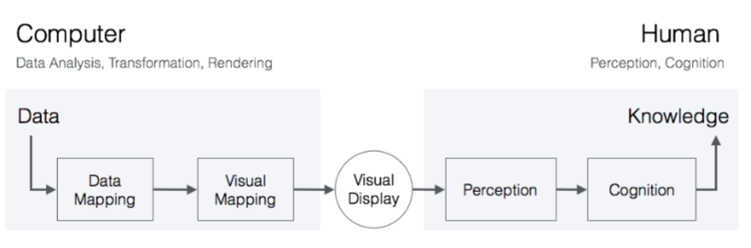
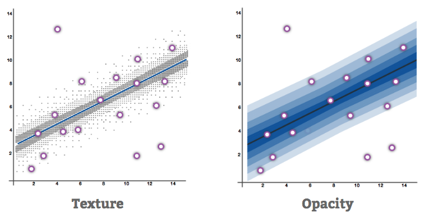
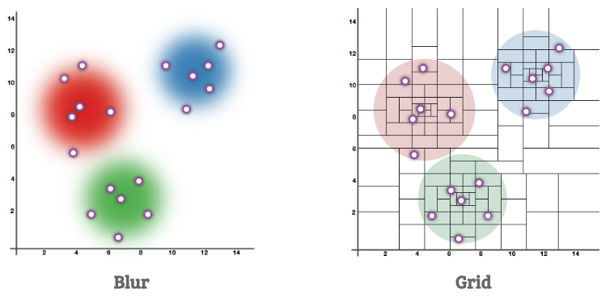
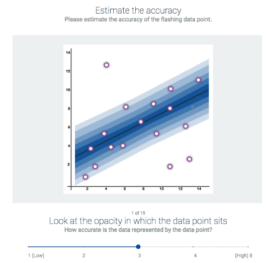

# Uncertainty Viz

A simple WebApp made with Meteor.js to evaluate visualization variables in uncertainty representations.

# Introduction

Nowadays, data is processed by tailored machine-learning algorithms that are stressed out by on real-time applications. In the pursuit of augmented knowledge, information is overwhelmed to provide deep insight using heuristics and algorithms.  

Information is presented to users in the form of graphical representations that enhance knowledge. Factors such as data incompleteness and model accuracy generate uncertainty that is not only propagated but also aggregated in each stage of the comunication process. 

Usually, uncertainty leads to confusion and bad decisions, creates a wrong perception of reality and has a huge impact in the final knowledge. It is essential that visualizations communicate the inherent uncertainty in order to help the users to make well and informed decisions.

# Screenshots

